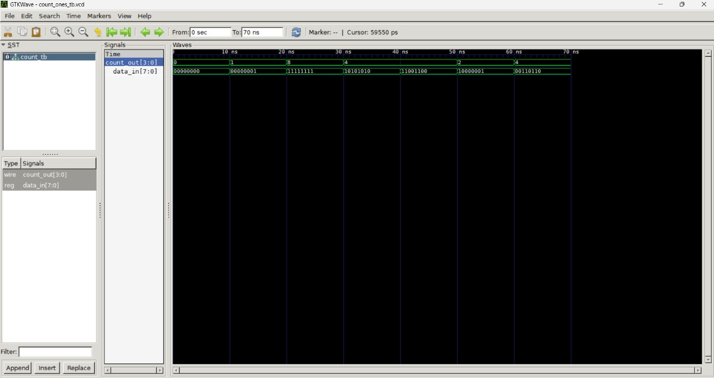

# Verilog Project: Count Number of 1’s in 8-bit Input

This is a Verilog group mini-project built for the **DDCO (Digital Design and Computer Organization)** course.  
The objective is to design and implement a **combinational logic circuit** that counts the number of `1`s in an 8-bit binary input using **Half Adders**.

---

## Objective

Design and implement a digital circuit in Verilog HDL that takes an 8-bit input and outputs the total number of bits that are set to 1.

---

## Project Files

| File Name     | Description                                 |
|---------------|---------------------------------------------|
| `count.v`     | Verilog module using Half Adders to process 8-bit input |
| `count_tb.v`  | Testbench with various input cases & waveform dumping |
| `.gitignore`  | Ensures simulation dump files like `.vcd` are not tracked |

---

## Logic Used

- The 8-bit input is grouped into 4 pairs (2 bits each).
- Each pair is passed through a **Half Adder** module.
- Based on the sum and carry output of each Half Adder:
  - `sum = 0` and `carry = 1` → 2 ones
  - `sum = 1` and `carry = 0` → 1 one
  - Else → 0 ones
- All counts are added to generate the final output.

---

## How to Run the Project

### Using Icarus Verilog

1. Compile the source and testbench:

```bash
iverilog -o count_sim count.v count_tb.v
```

2. Run the simulation:

```bash
vvp count_sim
```

3. (Optional) View waveform in GTKWave:

```bash
gtkwave count_ones_tb.vcd
```

---

## Sample Output (Terminal)

```bash
Time = 0  | data_in = 00000000 | count_out = 0
Time = 10 | data_in = 00000001 | count_out = 1
Time = 20 | data_in = 11111111 | count_out = 8
Time = 30 | data_in = 10101010 | count_out = 4
Time = 40 | data_in = 11001100 | count_out = 4
Time = 50 | data_in = 10000001 | count_out = 2
Time = 60 | data_in = 00110110 | count_out = 4
```

---

## GTKWave Visualization

> Example of waveform dump using GTKWave



---

## Author

**Shree Raksha** (she/her)  
B.Tech in Computer Science, PES University  
GitHub: [@shreeraksha-cs](https://github.com/shreeraksha-cs)

---

## Tools Used

- [Icarus Verilog](https://bleyer.org/icarus/)
- [GTKWave](https://gtkwave.sourceforge.net/)

---

⭐ If you found this project useful or interesting, please consider giving it a ⭐ star!

